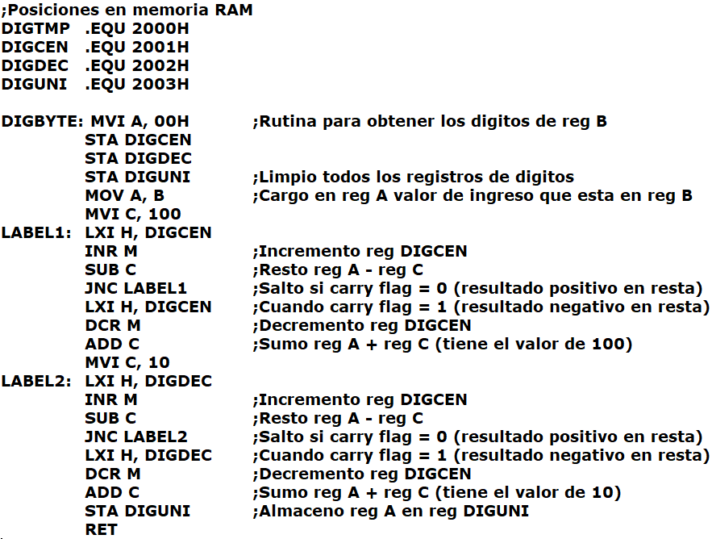

Esta subrutina sirve para obtener los dígitos de un registro de 8 bits en formato decimal: 

Para ello se tienen labels de registros DIGCEN, DIGDEC y DIGUNI, ubicados en la RAM que funcionarán como variables y que se alojarán los digitos de centena, decena y unidad respectivamente

