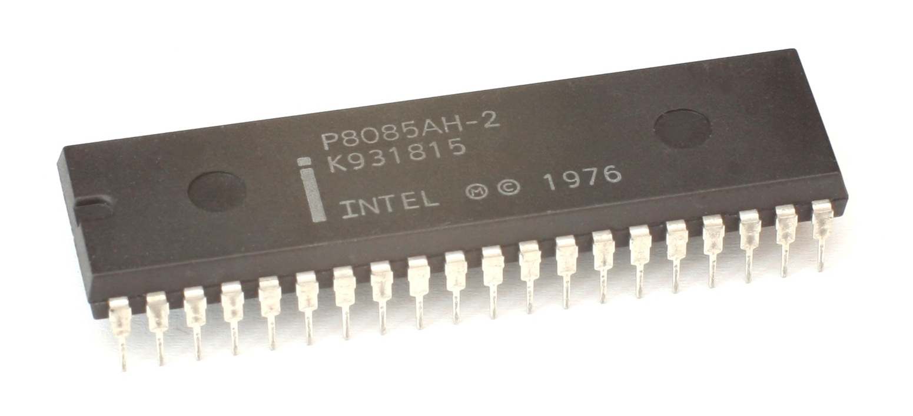

# Intel-8085-processor
A repository for the Intel 8085 processor, intended for Embedded System design and electronics applications
 

Reference links:

Hardware:
- Simple testing circuit for 8085 (freerun): http://saundby.com/electronics/8085/freerun.shtml
- Andreas Spiess 8085 platform: https://easyeda.com/editor#id=85b1b86d482748c79392f254dd90f14a|6faec151f2224e999d9fba18e1097c8b
Software:
- SB-Assembler 3 (cross assembler for the 8085): https://www.sbprojects.net/sbasm/index.php
- Python (needed for SB-Assembler 3): https://www.python.org/

Assembly programming:
- Andreas Spiess 8085 Assembler program examples: https://github.com/SensorsIot/8085-Computer
- Intel 8080/8085 Assembly Language Programming Manual: https://myethiolectures.files.wordpress.com/2015/06/programming-8085.pdf
- Assembly Language Programming of 8085 PDF: https://myethiolectures.files.wordpress.com/2015/06/programming-8085.pdf

Videos:
- Simple testing circuit for 8085: https://www.youtube.com/watch?v=OtQ-KTKzSHY
- Simple 8085 platform with 8155 part1: (Andreas Spiess): https://www.youtube.com/watch?v=45ELCAVb5XQ
- Simple 8085 platform with 8155 part1: (Andreas Spiess): https://www.youtube.com/watch?v=qizt0ePFEZA

LCD 16x2 HD44780:
- LCD Initialization: http://web.alfredstate.edu/faculty/weimandn/lcd/lcd_initialization/lcd_initialization_index.html
